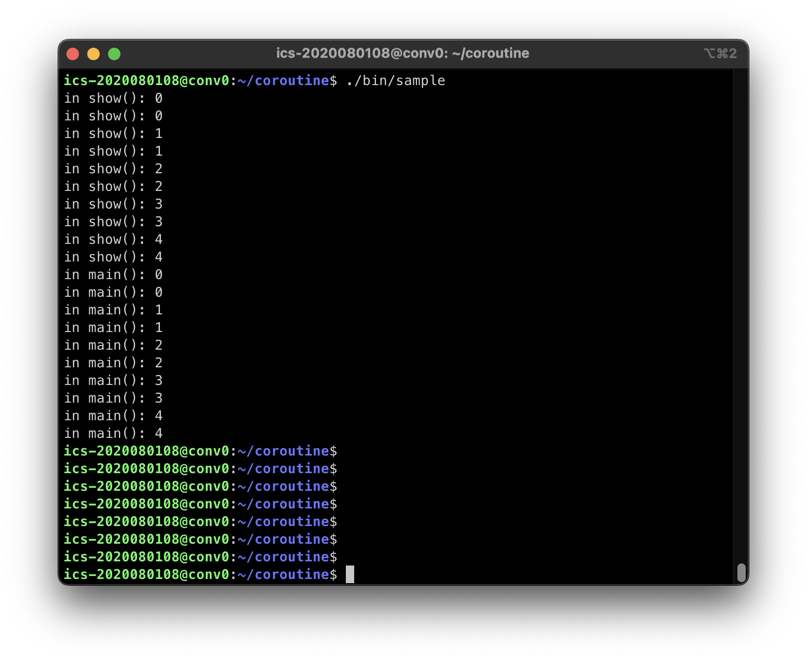
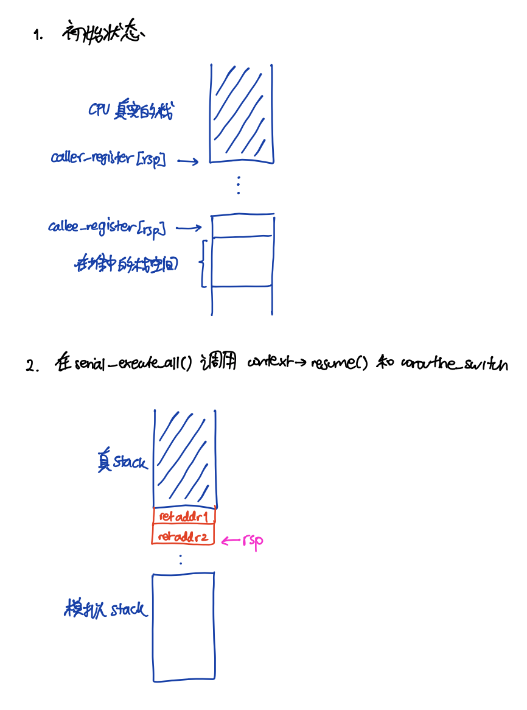
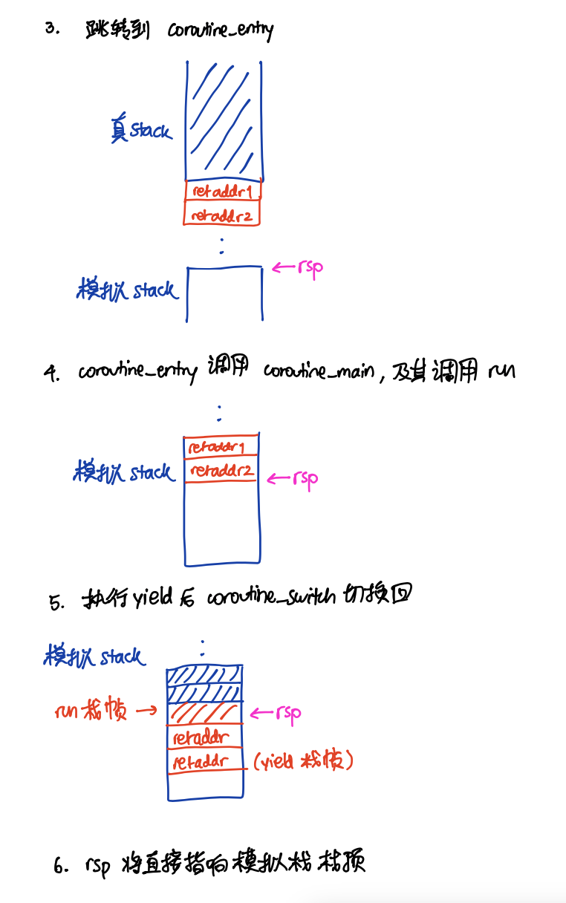
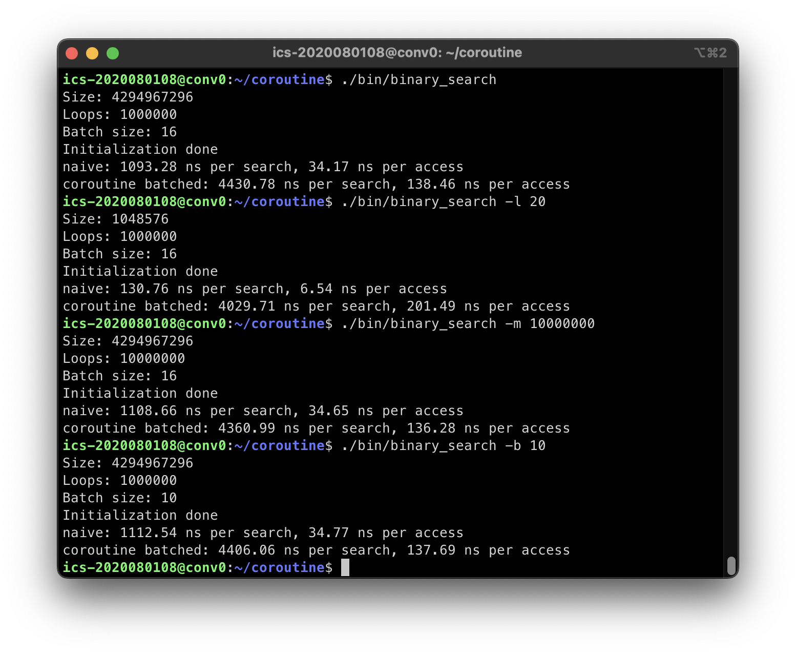

# 计算机系统概论 Coroutine Lab Report
### 李文赢 计05 2020080108

## Task 1
### 基本要求
### [1] 调度
在 serial_execute_all() 函数实现循环遍历所有协程，以及检查执行状态，直到所有协程都完成，代码修改见 Task2

### [2] Swap
```assembly
// ./lib/context.S
coroutine_switch:
    # 保存 callee-saved 寄存器到 %rdi 指向的上下文
    movq %rsp, 64(%rdi)
    movq %rbx, 72(%rdi)
    movq %rbp, 80(%rdi)
    movq %r12, 88(%rdi)
    movq %r13, 96(%rdi)
    movq %r14, 104(%rdi)
    movq %r15, 112(%rdi)
    # 保存的上下文中 rip 指向 ret 指令的地址（.coroutine_ret）
    leaq .coroutine_ret(%rip), %rax
    movq %rax, 120(%rdi)
    # 从 %rsi 指向的上下文恢复 callee-saved 寄存器
    movq 64(%rsi), %rsp
    movq 72(%rsi), %rbx
    movq 80(%rsi), %rbp
    movq 88(%rsi), %r12
    movq 96(%rsi), %r13
    movq 104(%rsi), %r14
    movq 112(%rsi), %r15
    # 最后 jmpq 到上下文保存的 rip
    movq 120(%rsi), %rax
    jmpq *%rax
```

### [3] 主动切出

```C++
/* ./inc/common.h */
void yield() {
  if (!g_pool->is_parallel) {
    auto context = g_pool->coroutines[g_pool->context_id];

    // 调用 coroutine_switch 切换到 coroutine_pool 上下文
    coroutine_switch(context->callee_registers, context->caller_registers);
  }
}
```

```C++
/* ./inc/context.h */
  virtual void resume() {
    // 调用 coroutine_switch
    coroutine_switch(caller_registers, callee_registers);
    // 在汇编中保存 callee-saved 寄存器，设置协程函数栈帧，然后将 rip 恢复到协程 yield 之后所需要执行的指令地址。
  }
```

### 运行结果


## 额外要求
### 1. 绘制协程切换时，栈的变化过程



### 2. 分析源代码，解释协程是如何跑起来的，包括 coroutine_entry 和 coroutine_main 函数以及初始的协程状态；

`basic_context`：初始的协程状态
```C++
// 对齐到 16 字节边界
uint64_t rsp = (uint64_t)&stack[stack_size - 1];
rsp = rsp - (rsp & 0xF);

void coroutine_main(struct basic_context * context);

callee_registers[(int)Registers::RSP] = rsp;
// 协程入口是 coroutine_entry
callee_registers[(int)Registers::RIP] = (uint64_t)coroutine_entry;
// 设置 r12 寄存器为 coroutine_main 的地址
callee_registers[(int)Registers::R12] = (uint64_t)coroutine_main;
// 设置 r13 寄存器，用于 coroutine_main 的参数
callee_registers[(int)Registers::R13] = (uint64_t)this;
```
- 为协程设置了初始状态，分配堆栈空间对齐到16字节边界，`rsp`栈指针指向堆上的空间。
- `rdi`寄存器设置为`coroutine_entry`
- `r12 r13`寄存器设置为 `coroutine_main`运行协程地址和参数

`coroutine_entry`: 是协程的入口函数
`coroutine_main`: 用于运行协程
```C++
void coroutine_main(struct basic_context *context) {
  context->run();
  context->finished = true;
  coroutine_switch(context->callee_registers, context->caller_registers);

  // unreachable
  assert(false);
}
```
在函数里运行执行函数 `run()` 执行该协程，如果没有 `yield` 函数就完成，将协程标注为 `finished = true`，然后调用 `coroutine_switch` 切换到调度器环境。


## Task 2
### [1] 完善 sleep 函数
```C++
void sleep(uint64_t ms) {
  if (g_pool->is_parallel) {
    auto cur = get_time();
    while (
        std::chrono::duration_cast<std::chrono::milliseconds>(get_time() - cur)
            .count() < ms)
      ;
  } else {
    // 从 g_pool 中获取当前协程状态
    auto context = g_pool->coroutines[g_pool->context_id];
    // 获取当前时间，更新 ready_func
    auto cur = get_time();
    // ready_func：检查当前时间，如果已经超时，则返回 true  
    context->ready = false;
    context->ready_func = [cur, ms]() -> bool {
      return std::chrono::duration_cast<std::chrono::milliseconds>(get_time()- cur).count() >= ms;
    };
    // 调用 coroutine_switch 切换到 coroutine_pool 上下文
    coroutine_switch(context->callee_registers, context->caller_registers);
  }
}
```

### [2] coroutine_pool::serial_execute_all 支持 ready 逻辑

```C++
  void serial_execute_all() {
    is_parallel = false;
    g_pool = this;

    while (true) {
      bool all_finished = true;
      g_pool->context_id = 0;

      for (auto& context : coroutines) {
        if (!context->finished) {
          if (context->ready || context->ready_func()) {
            context->ready = true;
            context->resume();
          }
          all_finished = false;
        }
        g_pool->context_id++;
      }
      if (all_finished) break;
    }
    coroutines.clear();
  }
```


## Task 3: 优化二分算法
```C++
// 使用 __builtin_prefetch 预取容易产生缓存缺失的内存
__builtin_prefetch(table + probe);
yield();
```

### 运行效果

